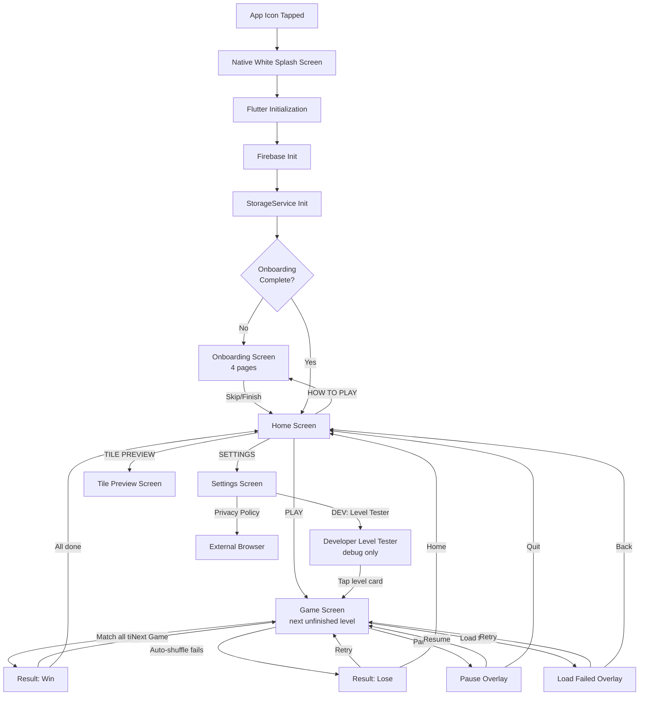
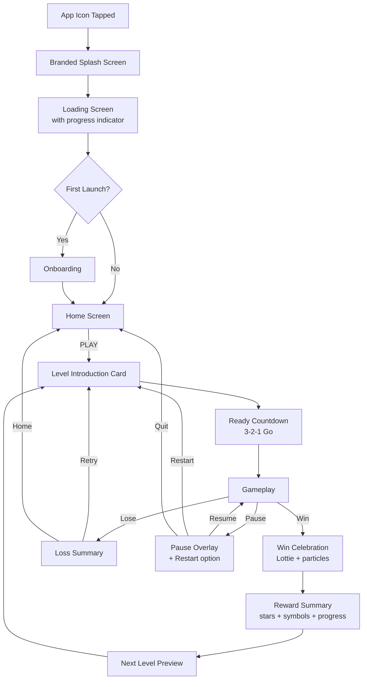

# GAME_FLOW.md — Sankofa Tiles

> Phase 5 note: this file is preserved as historical flow documentation from the earlier MVP audit. For the current release-readiness flow, use `docs/FINAL_GAME_FLOW.md` and `docs/CURRENT_GAME_FLOW.md`.

## 1. Purpose of this Document

This document maps the current user experience of Sankofa Tiles end-to-end. It documents exactly what happens at runtime based on the source code (as of 2026-06-24, version 1.0.0+3), not what was planned or what documentation previously claimed.

It helps identify where new screens, transitions, loading states, animations, tutorials, and monetization layers can be introduced.

---

## 2. Current App Launch Flow

```
App icon tapped
→ Android native splash screen (default white launch_background.xml)
→ Flutter engine initializes
→ Firebase.initializeApp() called
→ AnalyticsService.initialize() / CrashReportingService.initialize()
→ FlutterError.onError and PlatformDispatcher.onError wired to Crashlytics
→ SystemChrome.setPreferredOrientations([DeviceOrientation.portraitUp])
→ Status bar set to transparent with light icons
→ StorageService.init() loads SharedPreferences, migrates campaign progress schema if needed
→ ProviderScope created with StorageService override
→ SankofaTilesApp widget builds
→ GoRouter evaluates initial location "/"
  → If onboarding incomplete → redirect to "/onboarding"
  → Otherwise → HomeScreen at "/"
```

**Current state:**
- Android native splash is default white (no custom branding)
- No custom Flutter splash/lottie animation
- No loading/progress indicator during Firebase init
- No branded transitional screen between native splash and first Flutter frame
- Firebase init failure is caught silently — app continues without analytics/crashlytics
- Storage init failure rethrows — app crashes to a Flutter error screen
- Direct transition from white splash → dark green game screen (abrupt visual shift)

---

## 3. First-Time User Flow

```
App launched for the first time
→ StorageService.isOnboardingComplete() returns false
→ Router redirects from "/" to "/onboarding"
→ OnboardingScreen displays Page 1: Welcome to Adinkra Tiles (cultural intro)
  → Skip button visible (top-right) — skips to home immediately
  → NEXT button advances to next page
→ 4 pages: Culture → How to Play → Symbols → Ready
→ On final page: START PLAYING button calls _finish()
  → storage.setOnboardingComplete() writes flag
  → AnalyticsService.logOnboardingCompleted() fires
  → context.go('/') navigates to HomeScreen
→ HomeScreen: logo image, subtitle, 4 buttons
→ Tapping PLAY:
  → progressProvider.nextUnfinishedLevelId returns 1 (no progress exists)
  → context.push('/game/1') with GameLaunchConfig(levelId: 1, launchMode: normalProgression)
→ Level 1 starts — no tutorial overlay, no guided first match
→ Player must recall onboarding text or discover by tapping
```

**Current state:**
- No age gate or COPPA consent screen
- No permission requests (app requires none)
- No interactive tutorial — only static text/pictures in onboarding
- First level starts immediately after PLAY with no "ready" countdown
- Player can skip onboarding entirely and figure out gameplay through experimentation

---

## 4. Returning-User Flow

```
App launched by returning player
→ StorageService.isOnboardingComplete() returns true
→ Router stays at "/" (HomeScreen)
→ HomeScreen PLAY button:
  → progressProvider.nextUnfinishedLevelId computes from highestCompletedLevel
  → If level 5 completed → navigates to /game/6
  → If all 200 levels completed → shows "All Levels Completed" snackbar

Progress is determined by:
  - highest_completed_level integer in SharedPreferences
  - completed_N boolean keys for each completed level
  - Legacy migration handles old key formats (highest_unlocked_level, current_level, etc.)
```

**Current state:**
- No "Welcome back" or "Continue" messaging — just the home screen
- No daily reward or streak tracking
- Last game state is NOT restored — each PLAY starts a fresh level
- No level select screen — player cannot choose a previous level to replay for a better score
- Player must use Developer Level Tester (debug-only) to replay arbitrary levels

---

## 5. Main Navigation Flow

```
Home Screen (/)
├── PLAY
│   └── Gameplay Screen (/game/:nextLevelId)
│       ├── Back → Quit dialog → Home (/) or Dev Tester (/developer/levels)
│       ├── Settings gear → In-Game Settings Bottom Sheet
│       ├── Win → Result Screen (/result) → Next Game (/game/:nextId) or Home (/)
│       ├── Lose → Result Screen (/result) → Retry or Home (/)
│       └── Pause → Pause Overlay → Resume or Quit to Home
├── SETTINGS
│   └── Settings Screen (/settings)
│       ├── Audio controls (sound, music, volume)
│       ├── Haptic selector (off/low/medium/high)
│       ├── Show Tile Names toggle
│       ├── Privacy Policy (external browser)
│       └── Developer Tools section (debug-only)
│           ├── DEV: Level Tester → /developer/levels
│           └── Reset Real Player Progress
├── HOW TO PLAY
│   └── Onboarding Screen (/onboarding)
│       └── Skip/Finish → Home (/)
└── TILE PREVIEW
    └── Tile Preview Screen (/tile-preview)
        └── Browse ~90 symbols, view names and meanings

Developer Level Tester (/developer/levels — debug-only)
└── Tap any level card → Gameplay Screen (developerTest mode)
    └── No progress saved, no analytics logged
    └── Result shows developer action buttons
```

**What does NOT exist in the current navigation:**
- No level select screen (removed — replaced by direct progression)
- No shop/power-ups screen
- No daily challenges screen
- No achievements/leaderboard screen
- No profile/account screen

---

## 6. Complete Gameplay Flow

```
Player taps PLAY on Home Screen
→ progressProvider.nextUnfinishedLevelId resolves the appropriate level
→ GameScreen builds with GameLaunchConfig
→ initState: addPostFrameCallback calls gameProvider.notifier.startLevel(levelId, normal, isDeveloperTest: false)
→ GameNotifier.startLevel():
  → Looks up LevelDefinition by ID
  → Builds symbol deck from SymbolCopyPlan and tileIds
  → Generates board (reverse-solved or random+solver, depending on tile count)
  → Runs final solvability check (50,000 node budget)
  → If solvable: sets state to playing, starts background music
  → If unsolvable: sets state to loadFailed with error message
→ BoardWidget renders tiles with staggered fade+slide animation (25ms delay per tile)
→ Player interaction loop:
  → Tap free tile → selected (lifts, brightens)
  → Tap same tile → deselected
  → Tap matching free tile:
    → Unsafe move + safe alternative exists → BLOCKED (mismatch animation, streak reset)
    → Otherwise → MATCHED: +100 pts + streak bonus, particle burst (Inferno/Confetti/Nova), score pop, collision animation, streak incremented
  → Tap non-matching tile → mismatch shake, deselected after 600ms, streak reset
  → Check win: all tiles matched → GameStatus.won → navigate to /result after 600ms
  → Check stuck: no available matching pairs → auto-shuffle attempt (no penalty)
    → Shuffle succeeds → board rearranged, play continues
    → Shuffle fails → GameStatus.lost → navigate to /result after 600ms
→ Combo overlay triggers on 2+ consecutive matches (1.8s duration)
→ Hint: highlights a matching pair with pulse animation for 2 seconds
→ Shuffle: redistributes positions, -50 score penalty, solvability checked
→ Pause: overlay with Resume and Quit to Menu
→ Back: quit confirmation dialog → Stay or Leave
```

**No timer.** `secondsElapsed` is always 0. No time pressure, no time bonus.

**Match animation details:**
- Two styles randomly selected: `directCollision` (tiles slide toward midpoint) and `secondHitsFirst` (second tile slides to first tile's position)
- `secondHitsFirst` appears 1 in 4 times
- Collision burst (280×280 px CustomPaint overlay) with 3 variants: Inferno (22 glowing particles), Confetti (28 spinning rectangles), Nova (16 ring particles + flash)
- Score pop "+100" floats upward with fade-out

---

## 7. Win Flow

```
All tiles matched → GameNotifier._checkWin() triggers
→ GameState.status = GameStatus.won
→ Win sound plays (win.ogg)
→ Background music stops
→ BoardWidget shows gold shimmer overlay
→ GameScreen ref.listen detects status change
→ HapticService fires win celebration sequence (6 rapid impacts)
→ 600ms delay
→ context.go('/result', extra: GameResultConfig(gameState, launchConfig))
→ ResultScreen.initState:
  → _saveResult() called:
    → computeStars(score, level.starThresholds) — dynamic thresholds from complexity formula
    → If not developer test: AnalyticsService.logLevelCompleted(), progressProvider.saveLevelResult()
    → Only saves if new score/stars exceeds previous best
    → completed_N flag written, highest_completed_level updated
  → AnimationController starts (600ms elasticOut)
→ Win display shows:
  → Gold star burst symbol (✦) with scale animation
  → "Level Complete!" title
  → Level name in muted gold
  → 3 stars (filled or outlined based on stars earned)
  → Score breakdown: Pairs cleared, Moves used, TOTAL
  → If not last level: "NEXT GAME" button → context.go('/game/${levelId + 1}')
  → If last level (50): "All Levels Completed" text + "RETURN HOME" button
  → If developer test: BACK TO LEVEL TESTER / RETRY TEST LEVEL actions
```

**Current state:**
- No celebration Lottie animation (directory empty)
- No between-level transition screen ("Level Complete" → brief pause → "Next: Level N")
- No reward/progression animation (just the star display)
- Score breakdown does not show time bonus (no timer)
- BACK navigation on result screen sends user to appropriate origin (home or dev tester)

---

## 8. Loss Flow

```
No available matching pairs detected → GameNotifier._checkStuck() triggers
→ Step 1: Auto-shuffle attempt (penalizeScore: false, logUsage: false)
  → Shuffles unmatched tile positions, checks solvability (up to 80 attempts)
  → If solvable board found: applies shuffle, play continues (no penalty, no analytics log)
  → Player may not even notice this happened (transparent recovery)
→ Step 2: If shuffle fails after 80 attempts:
  → GameState.status = GameStatus.lost
  → AnalyticsService.logLevelFailed(levelId, difficulty, score, 'no_moves')
  → Lose sound plays (lose.ogg)
  → Background music stops
  → BoardWidget shows red overlay + shake animation
  → HapticService fires sombre sequence (3 slow heavy impacts)
  → 600ms delay
  → context.go('/result', extra: GameResultConfig)
→ Lose display shows:
  → Empty circle symbol (◌)
  → "No More Moves" title
  → Sankofa proverb quote with English translation
  → Score reached + Pairs matched counts
  → HOME button → context.go('/')
  → RETRY button → context.go('/game/${levelId}', extra: GameLaunchConfig)
  → Developer test: BACK TO LEVEL TESTER
```

**Current state:**
- No "revive" offer (watch ad, spend power-up to continue)
- Auto-shuffle means most potential losses become recoveries
- True loss only happens when board is fundamentally unsolvable after shuffle
- No "time expired" loss path (no timer)
- Loss does NOT affect saved progress (no penalty, no level lock-back)

---

## 9. Pause and Resume Flow

```
Pause triggered by:
  → Player taps Pause button in GameControlDock
  → Player taps Back button in GameHeader (shows quit dialog, which pauses first)
  → Player opens in-game settings (gear icon, pauses during settings)

On pause:
  → gameProvider.notifier.pauseGame()
    → If status is playing → sets status to paused
    → AnalyticsService.logPauseUsed() (unless developer test)
  → BoardWidget hidden behind semi-transparent overlay
  → Tiles preserved but interaction disabled via IgnorePointer
  → _PausedOverlay shown: "PAUSED" title, Resume button, Quit to Menu text button

On resume:
  → gameProvider.notifier.resumeGame()
    → If status is paused → sets status to playing
  → Overlay dismissed, board interaction restored

On quit from pause:
  → _leaveGame() called
    → gameProvider.notifier.leaveGame() → stops audio, resets state to idle
    → context.go('/') or context.go('/developer/levels') (depending on launch mode)

App backgrounding:
  → No explicit handling in game_provider.dart
  → No auto-pause on lifecycle change detected
  → Flutter framework handles widget tree preservation

App foregrounding:
  → No explicit resume handling
  → Game continues from whatever state was held in memory

Back button (Android) or swipe-back (iOS):
  → PopScope with canPop: false
  → onPopInvokedWithResult calls _confirmQuit()
  → Quit dialog shown
```

**Current state:**
- No auto-pause when app is backgrounded (potential issue)
- No pause timer display
- No "Restart Level" option in pause overlay (must quit to menu first, then PLAY again)
- No in-game settings access without pausing (gear icon pauses game first)

---

## 10. Settings Flow

```
Settings accessed from:
  → Home Screen: SETTINGS button
  → Game Screen: Settings gear icon (opens as bottom sheet, not full screen)

Full Settings Screen (/settings):
  → SankofaBackground + ListView
  → Audio section:
    → Sound Effects toggle (SwitchListTile) → settingsProvider.notifier.setSoundEnabled()
    → Background Music toggle → settingsProvider.notifier.setMusicEnabled()
    → Music Volume slider (0-100%, 10 divisions) → settingsProvider.notifier.setMusicVolume()
  → Haptic Feedback section:
    → Off / Low / Medium / High segmented selector
  → AdinkraDivider
  → Gameplay section:
    → Show Tile Names toggle with description
  → AdinkraDivider
  → Legal section:
    → Privacy Policy link → launchUrl() opens external browser
  → Developer Tools section (only when developerToolsEnabled):
    → DEV: Level Tester → navigates to /developer/levels
    → Reset Real Player Progress → confirmation dialog → resetProgress()

In-Game Settings Bottom Sheet:
  → ModalBottomSheet with archive color palette (AppColors)
  → Drag handle indicator
  → Sound Effects toggle, Background Music toggle, Music Volume slider
  → Show Tile Names toggle
  → Haptic selector
  → Close button

All settings persist immediately to SharedPreferences.
AudioService listens to settings changes and auto-syncs.
No settings require app restart.

Settings NOT available:
  → No difficulty selector (removed — always normal)
  → No tile theme selector
  → No language selector
  → No notification preferences
```

---

## 11. Developer Testing Flow

```
Accessing Developer Level Tester:
  → Settings Screen → Developer Tools section (visible in debug mode or ENABLE_DEVELOPER_TOOLS=true)
  → DEV: Level Tester button → context.push('/developer/levels')

Developer Level Tester Screen (/developer/levels):
  → Grid of all 50 level cards
  → Each card shows:
    → Level ID + name
    → Layout name, tile count, layer count
    → Compact tile dimensions + board fit status (SAFE/UNSAFE)
    → Difficulty category
    → Validation status
  → Action buttons:
    → TEST NEXT UNFINISHED — opens next incomplete level in test mode
    → TEST ALL SEQUENTIALLY — opens level 1 in test mode
    → RESET TEST SESSION — clears temporary session (does NOT affect real progress)
  → Tap any level card → opens /game/:levelId with launchMode: developerTest

Developer test gameplay:
  → GameHeader shows red "TEST" badge next to level number
  → Analytics events are SUPPRESSED (isDeveloperTest check)
  → No level results saved to SharedPreferences
  → Result screen shows developer-specific actions:
    → NEXT TEST LEVEL (win only)
    → RETRY TEST LEVEL
    → BACK TO LEVEL TESTER
  → Quitting returns to /developer/levels instead of /

Gating:
  → developerToolsEnabled = kDebugMode || enableDeveloperTools
  → enableDeveloperTools = bool.fromEnvironment('ENABLE_DEVELOPER_TOOLS', defaultValue: false)
  → If developer tools are disabled and someone navigates to /game/:levelId with launchMode: developerTest
    → Router returns HomeScreen instead (falls back safely)
  → /developer/levels route only registered when developerToolsEnabled is true
```

---

## 12. Screen and Overlay Inventory

| Screen or overlay | Type | Opened from | Main purpose | Possible exits | Current status |
| ----------------- | ---- | ----------- | ------------ | -------------- | -------------- |
| Home Screen | Full screen | App launch, onboarding finish, settings back | Main menu | Play, Settings, Onboarding, Tile Preview | Complete |
| Onboarding Screen | Full screen | First launch, Home "How to Play" | Tutorial/cultural intro | Skip→Home, Finish→Home | Complete |
| Game Screen | Full screen | Home PLAY, Dev Tester, Retry | Core gameplay | Win→Result, Lose→Result, Pause overlay, Quit→Home | Complete |
| Result Screen | Full screen | Game end (win/lose) | Show outcome and score | Next Game, Retry, Home | Complete |
| Settings Screen | Full screen | Home SETTINGS | App configuration | Back→previous screen | Complete |
| In-Game Settings Sheet | Modal bottom sheet | Game screen gear icon | Quick settings during play | Close→resume game | Complete |
| Tile Preview Screen | Full screen | Home TILE PREVIEW | Symbol reference gallery | Back→Home | Complete |
| Developer Level Tester | Full screen | Settings (debug only) | Test all 200 levels | Back→Settings, tap card→Game | Complete |
| Pause Overlay | Centered dialog overlay | Game pause button | Pause game | Resume, Quit to Menu | Complete |
| Quit Dialog | AlertDialog | Game back button | Confirm leaving game | Stay (resume), Leave (quit) | Complete |
| Load Failed Overlay | Centered dialog overlay | Board generation failure | Show error, offer retry | Try Again, Back to Levels | Complete |
| Combo Overlay | Top-center animated banner | 2+ consecutive matches | Show streak bonus | Auto-dismiss 1.8s | Complete |
| Match Particle Burst | CustomPaint overlay | Successful match | Visual celebration (3 variants) | Auto-dismiss ~700ms | Complete |
| Score Pop | Positioned text overlay | Successful match | "+100" floating text | Auto-dismiss 800ms | Complete |
| Win Board Shimmer | Positioned overlay | All tiles matched | Gold shimmer on board | Navigate to result | Complete |
| Lose Board Overlay | Positioned overlay + shake | Game lost | Red tint + shake animation | Navigate to result | Complete |
| Privacy Policy | External browser | Settings link | Show privacy policy | User closes browser | Complete |
| Reset Confirmation | AlertDialog | Settings reset button | Confirm progress deletion | Cancel, Reset | Complete |
| **Missing: Loading screen** | — | App launch after native splash | — | — | **MISSING** |
| **Missing: Level intro** | — | Before gameplay starts | — | — | **MISSING** |
| **Missing: Ready countdown** | — | Before tiles interactive | — | — | **MISSING** |
| **Missing: Celebration animation** | — | Win transition | — | — | **MISSING** |
| **Missing: Progress transition** | — | Between levels | — | — | **MISSING** |
| **Missing: Error screen** | — | Firebase/storage init failure | — | — | **MISSING** |
| **Missing: Offline notice** | — | No internet | — | — | **MISSING** |
| **Missing: Empty state** | — | All levels completed | — | — | **MISSING** |
| **Missing: Revive/continue** | — | After loss | — | — | **MISSING** |

---

## 13. Current Flow Diagram



---

## 14. Missing Experience Layers

The following experience gaps were identified by comparing the current implementation against common mobile game UX patterns:

### Launch & Loading
1. **No branded launch screen** — White Android splash jarringly transitions to dark green game UI. Should show branded logo/background during app init.
2. **No loading indicator** — Firebase and storage init happen with no visual feedback. If slow, user sees frozen white/flash screen.
3. **No init error screen** — If storage init fails, the app crashes with an unhandled error rather than showing a friendly "Something went wrong" screen.

### Onboarding & First Game
4. **No interactive tutorial** — Onboarding is purely informational text/pictures. First level has no guided steps, tooltips, or highlighted interactions.
5. **No "first match" celebration** — No special feedback when a new player makes their first successful match.

### Gameplay Experience
6. **No level introduction screen** — Player drops directly into the board with no level name, chapter context, tile count preview, or difficulty indicator.
7. **No "ready" countdown** — Tiles appear and are immediately interactive. No 3-2-1 countdown or "Go!" prompt.
8. **No between-level transition** — After winning, player sees result screen → taps Next → immediately in next level. No "Well done" transition, no chapter progress display.
9. **No progress celebration** — When completing a chapter (10 levels), there's no acknowledgment or reward screen.

### Post-Game
10. **No win celebration animation** — Lottie directory empty. Win shows static stars with scale animation only.
11. **No reward summary beyond stars** — No "New symbol unlocked," "Chapter complete," or collectible display.
12. **No "All Levels Complete" celebration** — Text message only, no fanfare for completing 200 levels.

### Resilience
13. **No offline handling** — App works offline (no network permission declared), but no indication to user that analytics/crashlytics are unavailable.
14. **No error retry screen** — Only `loadFailed` overlay for board generation failures. No general error state for other failures.
15. **No app-backgrounding handling** — Game doesn't auto-pause when app is backgrounded.

### Progression
16. **No level select** — Players cannot replay completed levels for better scores (outside debug tools).
17. **No "Continue" or "last played" indicator** — Returning players don't see which level they're on before tapping PLAY.

---

## 15. Suggested Future Flow

This is a **proposed** flow showing where experience layers could be added. It is NOT the current implementation.

```
App Icon Tapped
→ Branded Dark Splash Screen (replace white native splash)
→ Loading Screen (logo + progress indicator during Firebase/storage init)
→ Home Screen
→ Player taps PLAY
→ Level Introduction Card (level name, chapter, tile count, best score/star)
→ "Ready / Set / Match" 3-2-1 Countdown Overlay
→ Gameplay (current implementation)
→ Win:
  → Win Celebration (Lottie animation, particle burst)
  → Reward Summary (stars earned, new symbols seen, score breakdown)
  → Chapter Progress Bar (e.g., "7/10 in Paths of Wisdom")
  → Next Level Preview ("Next: Level 8 — Wisdom House")
  → Tap to Continue → Level Introduction Card → Countdown → Gameplay
→ Lose:
  → Loss Summary (current implementation)
  → Optional: Revive Offer (watch rewarded ad for one free shuffle)
→ All Levels Complete:
  → Grand Celebration Screen
  → "Thank You" / Total Stats Summary
  → Home
```

### Proposed Future Flow Diagram



---

## 16. Recommended Screen Additions

| Priority | Suggested screen or layer | Where it appears | Purpose | Difficulty |
| -------- | ------------------------- | ---------------- | ------- | ---------- |
| 1 | Branded splash screen | App launch | Replace white native splash with dark-themed logo | Low |
| 2 | Loading/init screen | After splash, before home | Show progress during Firebase/storage init | Low |
| 3 | Init error screen | Storage/Firebase init failure | Friendly error + retry instead of crash | Low |
| 4 | Level introduction card | Before gameplay | Show level name, chapter, best score | Low |
| 5 | "Ready" countdown | Before board becomes interactive | 3-2-1-Go overlay for anticipation | Medium |
| 6 | Win celebration animation | After win, before result screen | Lottie confetti/fireworks + particle burst | Medium |
| 7 | Between-level transition | Win result → next level | Smooth progress animation showing chapter advances | Medium |
| 8 | Level select screen | New route from home | Allow replay of completed levels for better scores | Medium |
| 9 | Interactive tutorial | First level | Guided first-match with overlay tooltips | High |
| 10 | Chapter completion screen | After every 10th level | Celebration + chapter summary | Medium |
| 11 | Grand finale celebration | After level 50 | Full celebration + stats recap + thank you | Medium |
| 12 | Auto-pause on background | App lifecycle | Pause game when app is backgrounded | Low |
| 13 | Revive/continue offer | After loss | "Watch ad for one free shuffle" (post-monetization) | High |
| 14 | Daily reward/challenge | Home screen | Daily engagement mechanic | High |
| 15 | Shop/power-ups | New route | Buy hint packs, tile themes (post-monetization) | High |

---

*Last updated: 2026-06-24 — documents current flow of version 1.0.0+3 (200 levels, no timer, linear progression, Firebase integrated).*
